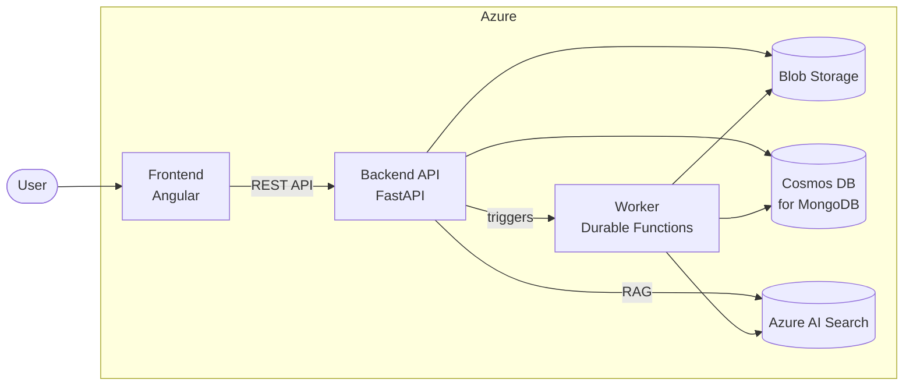

<p align="center">
  <picture>
    <source media="(prefers-color-scheme: dark)" srcset="https://github.com/user-attachments/assets/82108585-3fdc-49e7-ad92-4a51d2de79ee">
    
  </picture>
</p>
<p align="center">
  <b>Automated retro-documentation for existing codebases</b>
</p>
<p align="center">
  <a href="https://github.com/informatique-cdc/retro-doc/actions/workflows/ci.yml"></a>
  <a href="https://github.com/informatique-cdc/retro-doc/releases/latest"></a>
  <a href="https://github.com/informatique-cdc/retro-doc/blob/main/LICENSE"></a>
  <a href="https://angular.dev/"></a>
  <a href="https://www.python.org/"></a>
  <a href="https://conventionalcommits.org/"></a>
  <a href="https://prek.j178.dev"></a>
</p>


## About

Retro-Doc analyzes existing codebases to automatically generate documentation and structural insights. Upload a zip archive of your source code, and Retro-Doc extracts Abstract Syntax Trees (AST), Control Flow Graphs (CFG), and Data Flow Graphs (DFG), then makes the results explorable through an interactive UI, a RAG-powered chatbot, and an autonomous deep-analysis agent.

Built by the [Caisse des Dépôts Informatique (ICDC)](https://www.icdc.caissedesdepots.fr/).

## Table of Contents

- [Features](#features)
- [Architecture](#architecture)
- [Tech Stack](#tech-stack)
- [Repository Structure](#repository-structure)
- [Getting Started](#getting-started)
- [Contributing](#contributing)
- [Maintainers & Contributors](#maintainers--contributors)
- [License](#license)

## Features

- **Code analysis pipeline** — Upload a zip of source code, choose a target language, and run a multi-step analysis that extracts AST, CFG, and DFG graphs per file
- **Graph explorer** — Browse generated graphs interactively with [Cytoscape](https://cytoscape.org/)-based visualization
- **RAG chatbot** — Ask questions about the analyzed codebase in a conversational interface, powered by [LangChain](https://www.langchain.com/langchain/) with [Azure AI Search](https://azure.microsoft.com/en-us/products/ai-services/ai-search/) as the vector store
- **Deep analysis** — Submit free-form queries for autonomous multi-step code analysis using [DeepAgents](https://www.langchain.com/deep-agents/), with PDF export
- **Pipeline tracking** — Monitor analysis progress in real time (pending, running, completed, failed)
- **Multi-user support** — [Microsoft Entra ID](https://www.microsoft.com/en-gb/security/business/identity-access/microsoft-entra-id/) authentication, per-user repository lists, and shared repository access

## Architecture



| Component | Role |
|---|---|
| **Backend** | FastAPI server handling authentication, CRUD operations, chatbot conversations (SSE streaming), and deep analysis orchestration |
| **Frontend** | Angular SPA providing the UI for repository management, graph exploration, chatbot, and deep analysis |
| **Worker** | Azure Durable Functions app that runs the analysis pipeline: zip extraction, per-file AST/CFG/DFG generation, and summary creation |

## Tech Stack

### Backend (`backend/`)

[FastAPI](https://fastapi.tiangolo.com/) &bull; [Beanie](https://beanie-odm.dev/) &bull; [LangChain](https://www.langchain.com/langchain/) &bull; [LangGraph](https://langchain-ai.github.io/langgraph/) &bull; [DeepAgents](https://www.langchain.com/deep-agents/) &bull; [Mistral AI](https://mistral.ai/) &bull; [Azure AI Search](https://learn.microsoft.com/azure/search/) &bull; [Loguru](https://loguru.readthedocs.io/)

### Frontend (`frontend/`)

[Angular 21](https://angular.dev/) &bull; [Cytoscape.js](https://js.cytoscape.org/) &bull; [Mermaid](https://mermaid.js.org/) &bull; [highlight.js](https://highlightjs.org/)

### Worker (`worker/`)

[Azure Durable Functions](https://learn.microsoft.com/en-us/azure/durable-task/durable-functions/durable-functions-overview/) &bull; [javalang](https://github.com/c2nes/javalang) &bull; [NetworkX](https://networkx.org/) &bull; [Beanie](https://beanie-odm.dev/) &bull; [LangChain](https://www.langchain.com/langchain/) &bull; [Mistral AI](https://mistral.ai/) &bull; [Loguru](https://loguru.readthedocs.io/)

## Repository Structure

```
retro-doc/
├── backend/        # FastAPI REST API server
├── frontend/       # Angular SPA
├── worker/         # Azure Durable Functions analysis pipeline
└── LICENSE
```

Each component has its own dependency management and can be developed independently. See the `README.md` file in each folder for detailed documentation.

## Getting Started

### Prerequisites

- [Python 3.12](https://www.python.org/)
- [uv 0.10.9](https://docs.astral.sh/uv/)
- [Node.js 22](https://nodejs.org/) (for the frontend and Azure Functions Core Tools)
- [Azure Functions Core Tools v4](https://learn.microsoft.com/azure/azure-functions/functions-run-local) (for the worker)
- [Docker](https://www.docker.com/) (recommended, for running MongoDB locally)

### Infrastructure Services

The backend and the worker both require a **MongoDB** instance and an **Azure Blob Storage** account. For local development you can emulate both:

| Service | Local alternative | Production |
|---|---|---|
| MongoDB | Docker | Azure Cosmos DB for MongoDB |
| Blob Storage | [Azurite](https://github.com/Azure/Azurite) (included via npx) | Azure Blob Storage |
| AI Search | No local emulator -- requires an [Azure AI Search](https://learn.microsoft.com/azure/search/) instance | Azure AI Search |
| LLM / Embeddings | Any [LangChain-supported chat model](https://python.langchain.com/docs/integrations/chat/) provider | Mistral AI / Azure OpenAI |

> [!NOTE]
> An LLM endpoint is required for the full analysis pipeline (graph extraction + documentation generation), the RAG chatbot, and deep analysis. An embedding model and Azure AI Search are required for the chatbot and deep analysis. None of these can be emulated locally.

### Backend

```bash
cd backend
cp .env.example .env        # fill in your credentials
uv sync
uv run uvicorn app.main:app --host localhost --port 8000
```

API docs are available at `http://localhost:8000/docs` when `APP_DEBUG=True`.

### Frontend

```bash
cd frontend
npm install
npm start
```

The app is served at `http://localhost:4200/`.

### Worker

```bash
cd worker
cp .env.example .env        # fill in your credentials
uv sync
```

Start the local storage emulator and the Functions runtime in two terminals:

```bash
# Terminal 1
npx azurite --skipApiVersionCheck --location .azurite-data

# Terminal 2
func start
```

## Contributing

Contributions are welcome. This project uses [conventional commits](https://conventionalcommits.org) and [prek](https://prek.j178.dev) hooks for code quality.

```bash
uv run prek install   # backend & worker
```

## Maintainers & Contributors

- Pierre Houdyer (**@Grandvizir**) <a href="https://github.com/Grandvizir"><picture><source media="(prefers-color-scheme: dark)" srcset="https://cdn.simpleicons.org/github/white"></picture></a>
- Edgar Lopez (**@KhadgarLopez**) <a href="https://github.com/KhadgarLopez"><picture><source media="(prefers-color-scheme: dark)" srcset="https://cdn.simpleicons.org/github/white"></picture></a>
- Mickaël Mayeur (**@Mikatux**) <a href="https://github.com/Mikatux"><picture><source media="(prefers-color-scheme: dark)" srcset="https://cdn.simpleicons.org/github/white"></picture></a>
- Pierre-Alexandre Broux (**@pabroux**) <a href="https://github.com/pabroux"><picture><source media="(prefers-color-scheme: dark)" srcset="https://cdn.simpleicons.org/github/white"></picture></a>

## License

This project is licensed under the [Apache License 2.0](LICENSE).
